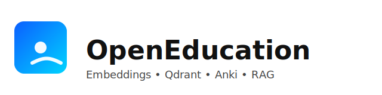

<p align="center">
  
  <br/>
  <a href="https://github.com/llamasearchai/OpenEducation/actions/workflows/ci.yml"></a>
  <a href="LICENSE"></a>
  
  <a href="https://github.com/llamasearchai/OpenEducation/releases"></a>
  
  
</p>

# OpenEducation: Comprehensive Educational Services Platform

**OpenEducation** is a comprehensive educational services platform that combines content processing, flashcard generation, English Language Development (ELD) instruction, and world languages education. Built with FastAPI, OpenAI embeddings, and Qdrant vector database.

## Overview

OpenEducation provides a complete educational ecosystem with the following components:

### Core Features
- **Content Processing**: Convert PDFs, DOCX, TXT, and Markdown files into searchable embeddings
- **Flashcard Generation**: Auto-generate Anki decks with Cloze deletions and Q/A cards
- **ELD Instruction**: Complete English Language Development program with WIDA standards
- **World Languages**: Comprehensive K-12 world languages curricula (Japanese, Mandarin, Korean, French, Spanish)
- **Vector Search**: Semantic search over educational content with RAG answering

### Educational Modules

#### 1. Content Processing & Flashcards
- Extract text from uploaded documents
- Generate embeddings with OpenAI `text-embedding-3-large`
- Store in local Qdrant vector database
- Create Anki decks with multiple card types
- Semantic search and RAG-powered Q/A

#### 2. English Language Development (ELD)
- **WIDA Standards Compliance**: Complete proficiency framework
- **Multi-Domain Assessment**: Social/Interpersonal, Instructional, Academic Language
- **Research-Based Strategies**: Scaffolded instruction, vocabulary development, content access
- **Progress Monitoring**: Individualized learning plans and assessment
- **Teacher Collaboration**: ELD specialist integration tools

#### 3. World Languages Instruction
- **ACTFL Standards**: Complete proficiency guidelines (Novice to Distinguished)
- **Five Language Programs**: Japanese, Mandarin, Korean, French, Spanish
- **K-12 Curricula**: Middle and High School levels with cultural integration
- **Communicative Approaches**: Interpersonal, Interpretive, Presentational modes
- **Cultural Activities**: Events, presentations, internships, exchanges

## Quick Start

### Prerequisites
- Python 3.11+
- OpenAI API key (for embeddings and advanced features)
- Docker (optional, for containerized deployment)

### Installation

```bash
# Clone the repository
git clone https://github.com/llamasearchai/OpenEducation.git
cd OpenEducation

# Install dependencies
pip install -r requirements.txt
```

### Basic Usage

```bash
# Start the web interface
uvicorn app.main:app --reload --port 8000
```

Open http://localhost:8000 to access the web interface for content processing and flashcard generation.

### Docker Deployment

```bash
# Start with Docker Compose
docker compose up --build
```

## Command Line Interface

OpenEducation includes comprehensive CLI tools for all modules:

### Core Commands
```bash
# Content processing and deck generation
python -m openeducation.cli ingest --help
python -m openeducation.cli generate --help

# ELD (English Language Development)
python -m openeducation.cli eld create-profile --help
python -m openeducation.cli eld assess-progress --help

# World Languages
python -m openeducation.cli languages show-curricula
python -m openeducation.cli languages create-lesson-plan --help
```

### ELD Module Examples

```bash
# Create ELD student profile
python -m openeducation.cli eld create-profile \
  --student-id "student_001" \
  --current-level "Developing" \
  --primary-language "Spanish" \
  --overall-score 2.8 \
  --domain-scores '{"Social_Interpersonal": 3.2}' \
  --program-entry-date "2024-01-15"

# Conduct progress assessment
python -m openeducation.cli eld assess-progress \
  --student-id "student_001" \
  --assessment-type "progress" \
  --proficiency-level "Developing" \
  --overall-score 3.2 \
  --strengths "Good participation" \
  --areas-for-growth "Vocabulary development"

# Generate ELD report
python -m openeducation.cli eld generate-report student_001 annual
```

### World Languages Examples

```bash
# View available curricula
python -m openeducation.cli languages show-curricula

# Get detailed curriculum
python -m openeducation.cli languages get-curriculum --language Japanese --level middle_school

# Create lesson plan
python -m openeducation.cli languages create-lesson-plan \
  --curriculum-id "jp_ms_curriculum" \
  --title "Japanese Greetings" \
  --grade-level "Middle School" \
  --objective "Students will learn Japanese greeting etiquette" \
  --communicative-goals '{"Interpersonal": ["Practice greetings"]}' \
  --language-functions "Greet others" \
  --vocabulary-focus "konnichiwa,hajimemashite" \
  --cultural-elements "Bowing etiquette"

# Create cultural activity
python -m openeducation.cli languages create-cultural-activity \
  --language Japanese \
  --title "Tea Ceremony Experience" \
  --description "Traditional Japanese tea ceremony workshop" \
  --activity-type cultural_event \
  --grade-levels "Middle School,High School" \
  --objectives "Experience cultural traditions" \
  --duration-hours 2
```

## Educational Standards Compliance

### ELD Standards
- **WIDA English Language Development Standards**
- **Can-Do Descriptors** for all proficiency levels
- **Multi-Domain Assessment** framework
- **Research-Based Instructional Strategies**
- **Progress Monitoring** and reporting

### World Languages Standards
- **ACTFL World-Readiness Standards**
- **Proficiency Levels**: Novice Low to Distinguished
- **Communication Modes**: Interpersonal, Interpretive, Presentational
- **Cultural Competency** integration
- **Technology Integration** standards

## Module Architecture

### Core Components
- **Content Processing**: Text extraction, embedding generation, vector storage
- **ELD System**: Student profiling, assessment, progress tracking, teacher collaboration
- **World Languages**: Curriculum management, lesson planning, cultural activities
- **Web Interface**: Upload interface, search tools, deck management

### Data Models
- **ELD Models**: Student profiles, lesson plans, assessments, collaboration records
- **Language Models**: Curricula, lesson plans, cultural activities, progress tracking
- **Content Models**: Documents, decks, flashcards, search results

## Configuration

Create a `.env` file or set environment variables:

```bash
# OpenAI Configuration
OPENAI_API_KEY=your_api_key_here
EMBEDDING_MODEL=text-embedding-3-large
GPT_MODEL=gpt-4o-mini
USE_GPT_QA=true

# Qdrant Configuration
QDRANT_PATH=./qdrant_data
QDRANT_COLLECTION=documents

# Processing Configuration
MAX_CHUNK_TOKENS=700
OVERLAP_TOKENS=100
RAG_K=5
RAG_MAX_CONTEXT_TOKENS=1600

# Feature Toggles
EXPOSE_ASK=true
```

## Testing

Run the comprehensive test suite:

```bash
# Run all tests
pytest -v

# Run specific module tests
pytest tests/test_eld.py -v
pytest tests/test_world_languages.py -v

# Run with coverage
pytest --cov=openeducation --cov-report=html
```

## Developer Setup

You can use any of the following workflows to set up a local dev environment.

### Using uv (fast Python manager)

```bash
# Create a virtual environment and install
uv venv
uv pip install -r requirements.txt
uv pip install ruff mypy tox hatch

# Lint, type-check, test
uv run ruff check .
uv run mypy .
uv run pytest -q
```

### Using Hatch

```bash
# Install hatch and create the default env
pip install hatch
hatch env create

# Run tasks
hatch run lint
hatch run types
hatch run test
```

### Using Tox

```bash
tox -q            # run tests on py311
tox -q -e lint    # ruff lint
tox -q -e types   # mypy type-check
```

### Using Make

```bash
make venv
make install
make lint
make types
make test
```

## CLI Entrypoint

After installing the package (editable or regular install), the `openeducation` command is available:

```bash
# Examples
openeducation version
openeducation ingest examples/config_examples/config.json --out-dir data/runs/latest
openeducation index data/runs/latest/content_blocks.json
openeducation generate data/runs/latest/content_blocks.json --deck-id deck_neuro --max-cards 10
openeducation export data/runs/latest/cards.json --deck-id deck_neuro --name TestDeck
```

## API Documentation

### Core Endpoints
- `POST /api/upload`: Upload and process documents
- `GET /api/decks`: List generated Anki decks
- `GET /api/search`: Semantic search over content
- `GET /api/answer`: RAG-powered Q/A with sources

### ELD Endpoints
- `POST /api/eld/profile`: Create/manage ELD student profiles
- `POST /api/eld/assessment`: Conduct ELD assessments
- `GET /api/eld/report`: Generate progress reports

### World Languages Endpoints
- `GET /api/languages/curricula`: Access language curricula
- `POST /api/languages/lesson`: Create lesson plans
- `POST /api/languages/activity`: Manage cultural activities

## Contributing

We welcome contributions to OpenEducation. Please see CONTRIBUTING.md for:

- Development workflow
- Code style guidelines
- Testing requirements
- Security considerations
- Documentation standards

## Educational Impact

OpenEducation serves as a comprehensive platform for:

### Students
- **Language Learning**: Structured ELD and world languages instruction
- **Content Access**: Academic content with language support
- **Cultural Understanding**: Authentic cultural experiences and activities
- **Progress Tracking**: Individualized learning and assessment

### Educators
- **Curriculum Tools**: Standards-aligned lesson planning
- **Assessment Systems**: Comprehensive progress monitoring
- **Collaboration Platform**: Teacher-ELD specialist coordination
- **Professional Development**: Research-based instructional strategies

### Administrators
- **Program Management**: Complete educational service delivery
- **Standards Compliance**: ACTFL and WIDA alignment
- **Progress Reporting**: Data-driven decision making
- **Resource Integration**: Technology and cultural activity management

## License

MIT License - see LICENSE file for details.

## Authors

- Nik Jois - Core development and educational framework
- Educational Module Contributors - ELD and World Languages specialists

## Professional Standards

OpenEducation is designed to meet the highest professional standards in education:

- **Research-Based**: All instructional strategies supported by peer-reviewed research
- **Standards-Aligned**: Full compliance with educational standards and frameworks
- **Culturally Responsive**: Inclusive design for diverse student populations
- **Technology Integration**: Modern tools for enhanced learning experiences
- **Professional Development**: Continuous improvement and training focus

---

**OpenEducation** represents a comprehensive solution for modern educational service delivery, combining cutting-edge technology with research-based pedagogical practices to support student success across diverse learning needs and cultural backgrounds.
